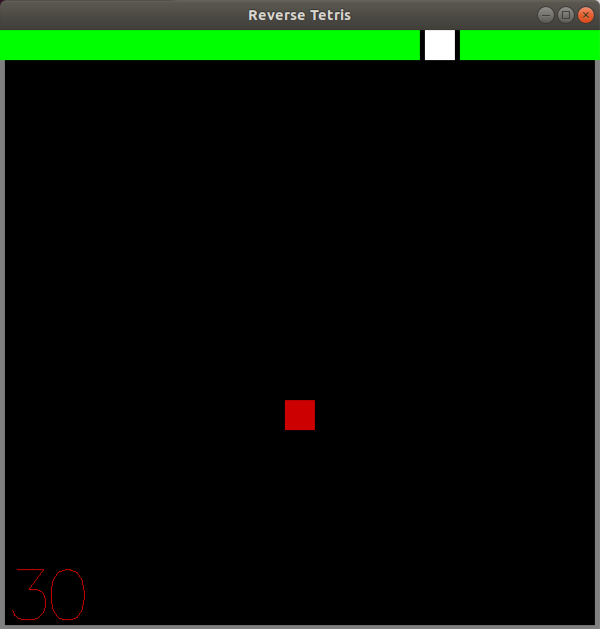

# Programaçao-Funcional
Repositório destinado aos trabalho de PF incluindo um Game desenvolvido em Haskel

**Trabalho 1**  
Desenvolver um justificador de texto 
Necessario instalar o compilador GHC  
`ghci`  
`:l t1.hs`  
`putStr( justifica "Este texto deve ser justificado corretamente"`

**GAME**

Jogo desenvolvido usando Haskel e gloss para os graficos  

**Como Compilar**

*Instruçoes*  
a - Movimento a esquerda  
d - Movimento a direita  
p - Pausar  
Esc - Sair  

